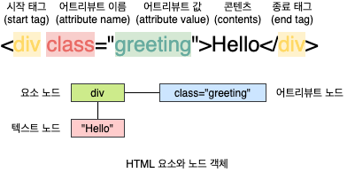
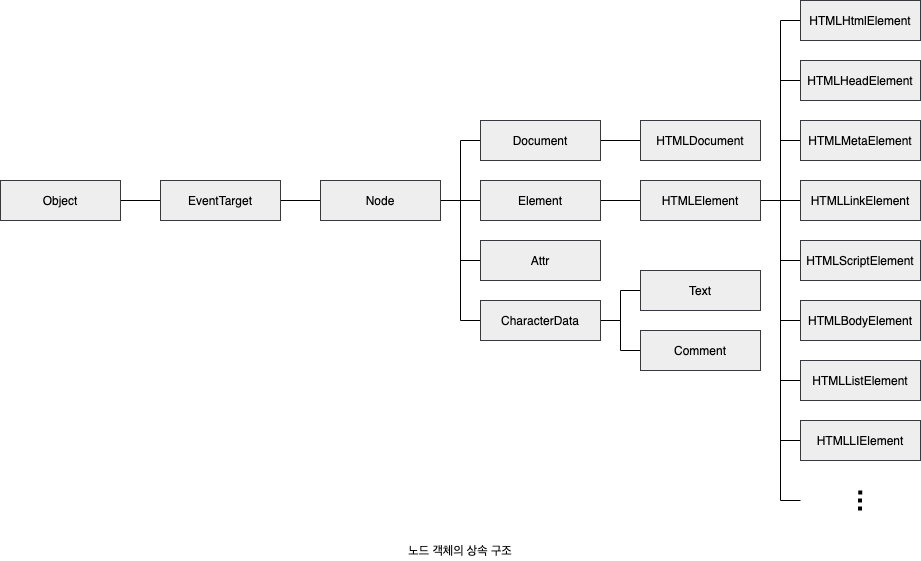
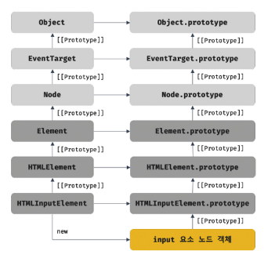
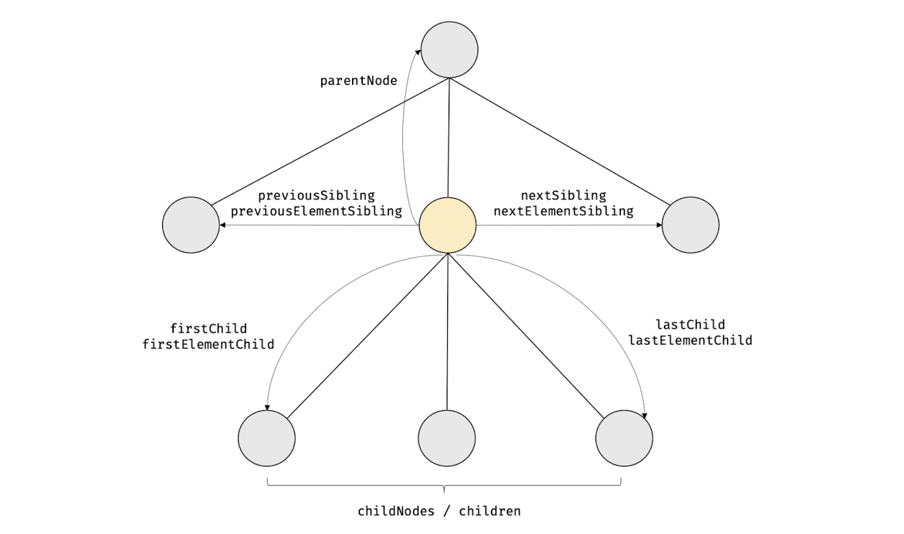
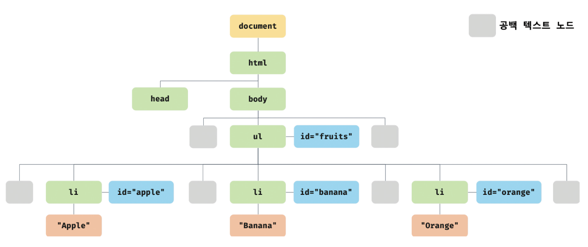
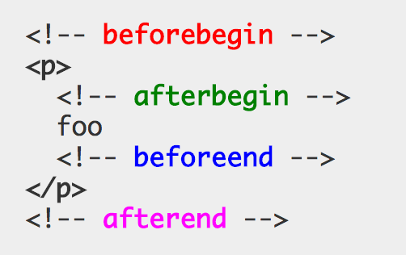

# [39장] DOM

DOM(Document Object Model): HTML 문서의 계층적 구조와 정보를 표현하며 이를 제어할 수 있는 API, 즉 프로퍼티와 메서드를 제공하는 트리 자료구조

### 39.1 노드
#### HTML 요소와 노드 객체
HTML 요소: HTML 문서를 구성하는 개별적인 요소 → 렌더링 과정에서 요소 노드 객체로 변환
- 어트리뷰트 → 어트리뷰트 노드
- 텍스트 콘텐츠 → 텍스트 노드


- 중첩 관계 → HTML 요소의 콘텐츠 영역에는 다른 HTML 요소도 포함할 수 있음 → parent-child 관계 형성

#### 트리 자료구조
- 부모 노드와 자식 노드로 구성되어 노드 간의 계층적 구조를 표현하는 비선형 자료구조
- 루트 노드(최상위 노드)에서 시작 → 0개 이상의 자식 노드를 가짐
- 리프 노드: 자식 노드가 없는 노드

#### DOM
노드 객체들로 구성된 트리 자료구조

#### 노드 객체의 타입
총 12개의 노트 타입이 있음
1. 문서 노드
    - DOM 트리의 최상위에 존재하는 루트 노드 → document 객체
    - 브라우저가 렌더링한 HTML 문서 전체를 가리키는 객체 → window.document
    - HTML 문서당 document 객체는 유일
    - DOM 트리의 노드들에 접근하기 위한 진입점 역할
2. 요소 노드: HTML 요소를 가리키는 객체 → 문서의 구조 표현
3. 어트리뷰트 노드: HTML 요소의 어트리뷰트를 가리키는 객체 → 요소 노드와 형제 관계(부모 노드 없음) → 어트리뷰트 노드에 접근하려면 요소 노드에 접근해야 함
4. 텍스트 노드: HTML 요소의 텍스트를 가리키는 객체
    - 문서의 정보 표현
    - 요소 노드의 자식 노드(리프 노드)
    - 텍스트 노드에 접근하려면 요소 노드에 접근해야 함
5. 그 외 노드: Comment 노드, DocumentType 노드, DocumentFragment 노드 등

#### 노드 객체의 상속 구조
DOM을 구성하는 노드 객체는 자신의 구조와 정보를 제어할 수 있는 DOM API 사용 가능 → 부모, 형제, 자식 노드 탐색, 어트리뷰트와 텍스트 조작



노드 객체는 프로토타입 체인에 있는 모든 프로토타입의 프로퍼티나 메서드를 상속받아 사용할 수 있음 → 개발자 도구의 Elements 패널 우측의 Properties 패널에서 확인 가능



- 노드 객체에는 노드 타입에 상관없이 모든 노드 객체가 공통으로 갖는 기능도 있고, 노드 타입에 따라 고유한 기능도 있음 e.g. EventTarget, Node 인터페이스 등
- HTML 요소가 갖는 공통적인 기능은 HTMLElement 인터페이스가 제공

### 39.2 요소 노드 취득
HTML의 구조나 내용 또는 스타일 등을 동적으로 조작하려면 요소 노드를 취득해야 함

#### `Document.prototype.getElementById`
- id를 이용한 요소 노드 취득
- 인수로 전달된 id 값을 갖는 첫번째 요소 노드를 탐색하여 반환 → 단 하나의 요소 노드만 반환
- id 값은 HTML 문서 내에서 유일한 값이어야 하며 공백 문자로 구분하여 여러 개의 값을 가질 수 없음
- 존재하지 않는 경우 null 반환
- HTML 요소에 id 어트리뷰트를 부여하면 id 값과 동일한 이름의 전역 변수가 암묵적으로 선언되고 해당 노드 객체가 할당됨 → 전역 변수가 이미 선언되어 있으면 재할당X

#### `Document.prototype/Element.prototype.getElementsByTagName`
- 태그 이름을 이용한 요소 노드 취득
- 인수로 전달된 태그 이름을 갖는 모든 요소 노드들을 탐색하여 반환 → 여러 개의 요소 노드 객체를 갖는 HTMLCollection 객체 반환(유사 배열 객체)
- 인수로 `*`를 전달하면 HTML 문서의 모든 요소 노드 취득 가능
- `Document.prototype` → document를 통해 호출(DOM 전체)
- `Element.prototype` → 특정 요소 노드를 통해 호출(자손 노드 탐색)
- 존재하지 않는 경우 빈 HTMLCollection 객체 반환

#### `Document.prototype/Element.prototype.getElementsByClassName`
- class를 이용한 요소 노드 취득
- 인수로 전달된 class 값을 갖는 모든 요소 노드들을 탐색하여 반환 → 공백으로 구분하여 여러 개의 class 지정 가능
- HTMLCollection 객체 반환
- `Document.prototype` → document를 통해 호출(DOM 전체)
- `Element.prototype` → 특정 요소 노드를 통해 호출(자손 노드 탐색)
- 존재하지 않는 경우 빈 HTMLCollection 객체 반환

#### selector
- selector(CSS 선택자): 스타일을 적용하고자 하는 HTML 요소를 특정할 때 사용하는 문법
```
/* 전체 선택자: 모든 요소를 선택 */
* { ... }
/* 태그 선택자: 모든 p 태그 요소를 모두 선택 */
p { ... }
/* id 선택자: id 값이 'foo'인 요소를 모두 선택 */
#foo { ... }
/* class 선택자: class 값이 'foo'인 요소를 모두 선택 */
.foo { ... }
/* 어트리뷰트 선택자: input 요소 중에 type 어트리뷰트 값이 'text'인 요소를 모두 선택 */
input[type=text] { ... }
/* 후손 선택자: div 요소의 후손 요소 중 p 요소를 모두 선택 */
div p { ... }
/* 자식 선택자: div 요소의 자식 요소 중 p 요소를 모두 선택 */
div > p { ... }
/* 인접 형제 선택자: p 요소의 형제 요소 중에 p 요소 바로 뒤에 위치하는 ul 요소를 선택 */
p + ul { ... }
/* 일반 형제 선택자: p 요소의 형제 요소 중에 p 요소 뒤에 위치하는 ul 요소를 모두 선택 */
p ~ ul { ... }
/* 가상 클래스 선택자: hover 상태인 a 요소를 모두 선택 */
a:hover { ... }
/* 가상 요소 선택자: p 요소의 콘텐츠의 앞에 위치하는 공간을 선택
   일반적으로 content 프로퍼티와 함께 사용된다. */
p::before { ... }
```

#### CSS 선택자를 이용한 요소 노드 취득
- **`Document.prototype/Element.prototype.querySelector`**
  - 인수로 전달된 selector를 만족시키는 첫번째 요소 노드 반환
  - 존재하지 않는 경우 null 반환
  - selector가 문법에 맞지 않는 경우 DOMException 에러 발생
- **`Document.prototype/Element.prototype.querySelectorAll`**
  - 인수로 전달된 selector를 만족시키는 모든 요소를 탐색하여 반환
  - 존재하지 않는 경우 빈 NodeList 객체 반환
  - selector가 문법에 맞지 않는 경우 DOMException 에러 발생å
  - HTML 문서의 모든 요소 노드를 취득하려면 인수로 `*` 전달
- `querySelector`, `querySelectorAll` 메서드는 `getElementById`, `getElementsBy***` 메서드보다 느림

#### `Element.prototype.matches`
인수로 전달된 selector를 통해 특정 요소 노드를 취득할 수 있는지 확인

#### HTMLCollection
- 노드 객체의 상태 변화를 실시간으로 반영 → live DOM Collection 객체

*주의)* 실시간으로 노드 객체의 상태 변경을 반영하여 요소를 제거할 수 있기 때문에 for 문으로 순회할 때 예상대로 동작하지 않을 수 있음

#### NodeList
- 실시간으로 노드 객체의 상태 변경을 반영하지 않는 객체 → non-live
- forEach 메서드 사용 가능

*주의)* childNodes 프로퍼티가 반환하는 NodeList 객체는 live 객체로 동작

```
노드 객체의 상태 변경과 상관없이 안전하게 DOM 컬렉션을 사용하려면 HTMLCollection이나 NodeList 객체를 배열로 변환하여 사용하는 것이 권장됨
```
```
<!DOCTYPE html>
<html>
  <body>
    <ul id="fruits">
      <li>Apple</li>
      <li>Banana</li>
    </ul>
  </body>
  <script>
    const $fruits = document.getElementById('fruits');

    // childNodes 프로퍼티는 NodeList 객체(live)를 반환한다.
    const { childNodes } = $fruits;

    // 스프레드 문법을 사용하여 NodeList 객체를 배열로 변환한다.
    [...childNodes].forEach(childNode => {
      $fruits.removeChild(childNode);
    });

    // $fruits 요소의 모든 자식 노드가 모두 삭제되었다.
    console.log(childNodes); // NodeList []
  </script>
</html>
```

### 39.3 노드 탐색

- 노드 탐색 프로퍼티는 모두 getter만 존재하는 읽기 전용 접근자 프로퍼티

#### 공백 텍스트 노드
HTML 요소 사이의 스페이스, 탭, 줄바꿈 등의 공백 문자는 텍스트 노드를 생성
```
<!DOCTYPE html>
<html>
  <body>
    <ul id="fruits">
      <li class="apple">Apple</li>
      <li class="banana">Banana</li>
      <li class="orange">Orange</li>
    </ul>
  </body>
</html>
```


#### 자식 노드 탐색
프로퍼티 | 설명
--- | ---
`Node.prototype.childNodes` | 자식 노드를 모두 탐색하여 NodeList로 반환 → 텍스트 노드도 포함되어 있을 수 있음
`Element.prototype.children` | 자식 노드 중에서 요소 노드만 모두 탐색하여 HTMLCollection으로 반환 → 텍스트 노드 포함X
`Node.prototype.firstChild` | 첫번째 자식 노드 반환(텍스트 노드 또는 요소 노드)
`Node.prototype.lastChild` | 마지막 자식 노드 반환(텍스트 노드 또는 요소 노드)
`Element.prototype.firstElementChild` | 첫번째 자식 요소 노드 반환
`Element.prototype.lastElementChild` | 마지막 자식 요소 노드 반환

#### 자식 노드 존재 확인
- `Node.prototype.hasChildNodes`: 자식 노드의 존재 여부를 boolean 값으로 반환
- `children.length`/`childElementCount`: 텍스트 노드가 아닌 자식 요소 노드의 존재 여부 확인

#### 그 외 노드 탐색
- `Node.prototype.firstChild`: 텍스트 노드 탐색
- `Node.prototype.parentNode`: 부모 노드 탐색
- 형제 노드 탐색

프로퍼티 | 설명
--- | ---
`Node.prototype.previousSibling` | 자신의 이전 형제 노드를 탐색하여 반환(요소 노드 또는 텍스트 노드)
`Node.prototype.nextSibling` | 자신의 다음 형제 노드를 탐색하여 반환(요소 노드 또는 텍스트 노드)
`Element.prototype.previousElementSibling` | 자신의 이전 형제 요소 노드 반환
`Element.prototype.nextElementSibling` | 자신의 다음 형제 요소 노드 반환

### 39.4 노드 정보 취득
<table>
<tr><th>프로퍼티</th><th>설명</th></tr>
<tr>
<td>Node.prototype.nodeType</td>
<td>
노드 타입을 나타내는 상수 반환<br/>
- Node.ELEMENT_NODE: 상수 1 반환<br/>
- Node.TEXT_NODE: 상수 3 반환<br/>
- Node.DOCUMENT_NODE: 상수 9 반환<br/>
</td>
</tr>
<tr>
<td>Node.prototype.nodeName</td>
<td>
노드의 이름을 문자열로 반환<br/>
- 요소 노드: 대문자 문자열로 태그 이름 반환<br/>
- 텍스트 노드: "#text" 반환<br/>
- 문서 노드: "#document" 반환
</td>
</tr>
</table>

### 39.5 요소 노드의 텍스트 조작
#### `Node.prototype.nodeValue`
- 노드 객체의 값(텍스트 노드의 텍스트) 반환
- setter, getter 모두 존재하는 접근자 프로퍼티
- 텍스트 노드가 아닌 노드의 nodeValue 프로퍼티를 참조하면 null 반환

#### `Node.prototype.textContent`
- 요소 노드의 텍스트와 모든 자손 노드의 텍스트를 모두 취득하거나 변경 → 요소 노드의 콘텐츠 영역 내의 텍스트 모두 반환(HTML 마크업 무시)
- setter, getter 모두 존재하는 접근자 프로퍼티
- 요소 노드의 콘턴츠 영역에 자식 요소 노드가 없고 텍스트만 존재한다면 `textContent` 프로퍼티를 사용하는 것이 더 간단함
- 문자열을 할당하면 요소 노드의 모든 자식 노드가 제거되고 할당한 문자열이 텍스트로 추가

*cf)* `innerText`은 `textContent`와 유사하지만 권장되지 않음
- CSS에 순종적 e.g. CSS에 의해 비표시로 지정된 요소 노드의 텍스트는 반환하지 않음
- CSS를 고려해야 하므로 `textContent` 프로퍼티보다 느림

### 39.6 DOM 조작
DOM 조작: 새로운 노드를 생성하여 DOM에 추가하거나 기존 노드를 삭제 또는 교체하는 것 → 리플로우와 리페인트 발생

#### `Element.prototype.innerHTML`
- 요소 노드의 HTML 마크업을 취득하거나 변경 → 문자열로 반환
- setter, getter 모두 존재하는 접근자 프로퍼티
- `textContent`는 HTML 마크업을 무시하고 텍스트만 반환하지만 `innerHTML`은 HTML 마크업이 포함된 문자열을 그대로 반환
- 문자열을 할당하면 요소 노드의 모든 자식 노드가 제거되고 할당한 문자열에 포함되어 있는 HTML 마크업이 파싱되어 요소 노드의 자식 노드가 됨

[주의] 사용자에게 입력받은 데이터를 그대로 innerHTML에 할당하면 XSS 공격에 취약함 → HTML 마크업 안에 js 악성 코드가 포함되어 있으면 그대로 실행됨
```
<!DOCTYPE html>
<html>
  <body>
    <div id="foo">Hello</div>
  </body>
  <script>
    // innerHTML 프로퍼티로 스크립트 태그를 삽입하여 자바스크립트가 실행되도록 한다.
    // HTML5는 innerHTML 프로퍼티로 삽입된 script 요소 내의 자바스크립트 코드를 실행하지 않는다.
    document.getElementById('foo').innerHTML
      = '<script>alert(document.cookie)</script>';
  </script>
</html>
```
HTML5는 innerHTML로 삽입된 script 요소 내의 자바스크립트 코드를 실행하지 않지만 script 요소 없이도 공격이 가능함
```
<!DOCTYPE html>
<html>
  <body>
    <div id="foo">Hello</div>
  </body>
  <script>
    // 에러 이벤트를 강제로 발생시켜서 자바스크립트 코드가 실행되도록 한다.
    document.getElementById('foo').innerHTML
      = ``;
  </script>
</html>
```
*cf)* HTML sanitization
사용자로부터 입력받은 데이터에 의해 발생할 수 있는 XSS 공격을 예방하기 위해 잠재적 위험을 제거하는 기능 → 함수 직접 구현 or DOMPurify 라이브러리 사용
`DOMPurify.sanitize('');`

**innerHTML의 단점**
- XSS 공격에 취약함
- HTML 마크업 문자열을 할당하는 경우 요소 노드의 모든 자식 노드를 제거함 → 유지되어도 좋은 기존의 자식 노드까지 모두 제거하고 다시 새롭게 자식 노드를 생성
- 새로운 요소를 삽입할 때 삽입될 위치를 지정할 수 없음

#### `Element.prototype.insertAdjacentHTML(position, DOMString)`
- 기존 요소를 제거하지 않으면서 위치를 지정해 새로운 요소 삽입 → innerHTML보다 효율적
- 두번째 인수로 전달된 `DOMString`을 파싱해서 생성된 노드를 첫번째 인수로 전달한 `position`에 삽입
- position → `beforebegin || afterbegin || beforeend || afterend`

  

- XSS 공격에 취약함

#### 노드 생성과 추가
1. `Document.prototype.createElement(tagName)` → 자식 노드를 가지고 있지 않음
2. `Document.prototype.createTextNode(text)`: 텍스트 노드 생성
3. `Node.prototype.appendChild(childNode)`: `childNode`를 메서드를 호출한 노드의 마지막 자식 노드로 추가
```
<!DOCTYPE html>
<html>
  <body>
    <ul id="fruits">
      <li>Apple</li>
    </ul>
  </body>
  <script>
    const $fruits = document.getElementById('fruits');

    // 1. 요소 노드 생성
    const $li = document.createElement('li');

    // 2. 텍스트 노드 생성
    const textNode = document.createTextNode('Banana');

    // 3. 텍스트 노드를 $li 요소 노드의 자식 노드로 추가
    $li.appendChild(textNode);

    // 4. $li 요소 노드를 #fruits 요소 노드의 마지막 자식 노드로 추가
    $fruits.appendChild($li);
  </script>
</html>
```

#### `Document.prototype.createDocumentFragment`
- 노드 객체의 일종으로 부모 노드가 없어 기존 DOM과는 별도로 존재
- 복수의 노드 생성과 추가에 유용
- DOM 변경은 높은 비용이 드는 처리(리플로우, 리페인트) → `DocumentFragment` 노드에 자식 노드를 추가하면 기존 DOM에는 어떠한 변경도 발생하지 않음
- `DocumentFragment` 노드를 DOM에 추가하면 자신은 제거되고 자신의 자식 노드만 DOM에 추가

```
<!DOCTYPE html>
<html>
  <body>
    <ul id="fruits"></ul>
  </body>
  <script>
    const $fruits = document.getElementById('fruits');

    // DocumentFragment 노드 생성
    const $fragment = document.createDocumentFragment();

    ['Apple', 'Banana', 'Orange'].forEach(text => {
      // 1. 요소 노드 생성
      const $li = document.createElement('li');

      // 2. 텍스트 노드 생성
      const textNode = document.createTextNode(text);

      // 3. 텍스트 노드를 $li 요소 노드의 자식 노드로 추가
      $li.appendChild(textNode);

      // 4. $li 요소 노드를 DocumentFragment 노드의 마지막 자식 노드로 추가
      $fragment.appendChild($li);
    });

    // 5. DocumentFragment 노드를 #fruits 요소 노드의 마지막 자식 노드로 추가
    $fruits.appendChild($fragment);
  </script>
</html>
```

#### 노드 삽입
1. `Node.prototype.appendChild`: 인수로 전달받은 노드를 항상 자신을 호출한 노드의 마지막 자식 노드로 추가
2. `Node.prototype.insertBefore(newNode, childNode)`: 첫번째 인수로 전달받은 노드를 두번째 인수로 전달받은 노드 앞에 삽입 → `childNode`는 반드시 호출한 노드의 자식 노드여야 함. `null`이면 마지막 자식 노드로 추가
```
<!DOCTYPE html>
<html>
  <body>
    <div>test</div>
    <ul id="fruits">
      <li>Apple</li>
      <li>Banana</li>
    </ul>
  </body>
  <script>
    const $fruits = document.getElementById('fruits');

    // 요소 노드 생성
    const $li = document.createElement('li');

    // 텍스트 노드를 $li 요소 노드의 마지막 자식 노드로 추가
    $li.appendChild(document.createTextNode('Orange'));

    // $li 요소 노드를 #fruits 요소 노드의 마지막 자식 요소 앞에 삽입
    $fruits.insertBefore($li, $fruits.lastElementChild);
    // Apple - Orange - Banana

    // 두 번째 인수로 전달받은 노드는 반드시 #fruits 요소 노드의 자식 노드이어야 한다.
    $fruits.insertBefore($li, document.querySelector('div'));
    // DOMException

    // 두 번째 인수로 전달받은 노드가 null이면 $li 요소 노드를 #fruits 요소 노드의 마지막 자식 노드로 추가
    $fruits.insertBefore($li, null);
  </script>
</html>
```

#### 노드 이동
DOM에 이미 존재하는 노드를 `appendChild` 또는 `insertBefore` 메서드를 사용하여 DOM에 다시 추가하면 현재 위치에서 노드를 제거하고 새로운 위치에 노드를 추가함
```
<!DOCTYPE html>
<html>
  <body>
    <ul id="fruits">
      <li>Apple</li>
      <li>Banana</li>
      <li>Orange</li>
    </ul>
  </body>
  <script>
    const $fruits = document.getElementById('fruits');

    // 이미 존재하는 요소 노드를 취득
    const [$apple, $banana, ] = $fruits.children;

    // 이미 존재하는 $apple 요소 노드를 #fruits 요소 노드의 마지막 노드로 이동
    $fruits.appendChild($apple); // Banana - Orange - Apple

    // 이미 존재하는 $banana 요소 노드를 #fruits 요소의 마지막 자식 노드 앞으로 이동
    $fruits.insertBefore($banana, $fruits.lastElementChild);
    // Orange - Banana - Apple
  </script>
</html>
```

#### 노드 복사 - `Node.prototype.cloneNode([deep: true | false])`
노드의 사본을 생성하여 반환
- deep: true → 깊은 복사 → 모든 자손 노드가 포함된 사본 생성
- deep: false → 얕은 복사 → 노드 자신만의 사본 생성(자손 노드 복사X)
```
<!DOCTYPE html>
<html>
  <body>
    <ul id="fruits">
      <li>Apple</li>
    </ul>
  </body>
  <script>
    const $fruits = document.getElementById('fruits');
    const $apple = $fruits.firstElementChild;

    // $apple 요소를 얕은 복사하여 사본을 생성. 텍스트 노드가 없는 사본이 생성된다.
    const $shallowClone = $apple.cloneNode();
    // 사본 요소 노드에 텍스트 추가
    $shallowClone.textContent = 'Banana';
    // 사본 요소 노드를 #fruits 요소 노드의 마지막 노드로 추가
    $fruits.appendChild($shallowClone);

    // #fruits 요소를 깊은 복사하여 모든 자손 노드가 포함된 사본을 생성
    const $deepClone = $fruits.cloneNode(true);
    // 사본 요소 노드를 #fruits 요소 노드의 마지막 노드로 추가
    $fruits.appendChild($deepClone);
  </script>
</html>
```

#### 노드 교체 - `Node.prototype.replaceChild(newChild, oldChild)`
- 자신을 호출한 노드의 자식 노드(`oldChild`)를 다른 노드(`newChild`)로 교체 → `oldChild`는 DOM에서 제거
- `oldChild`는 반드시 `replaceChild` 메서드를 호출한 노드의 자식 노드여야 함
```
<!DOCTYPE html>
<html>
  <body>
    <ul id="fruits">
      <li>Apple</li>
    </ul>
  </body>
  <script>
    const $fruits = document.getElementById('fruits');

    // 기존 노드와 교체할 요소 노드를 생성
    const $newChild = document.createElement('li');
    $newChild.textContent = 'Banana';

    // #fruits 요소 노드의 첫 번째 자식 요소 노드를 $newChild 요소 노드로 교체
    $fruits.replaceChild($newChild, $fruits.firstElementChild);
  </script>
</html>
```

#### 노드 삭제 - `Node.prototype.removeChild(child)`
- 인수로 전달한 노드를 DOM에서 삭제 → `removeChild` 메서드를 호출한 노드의 자식 노드여야 함
```
<!DOCTYPE html>
<html>
  <body>
    <ul id="fruits">
      <li>Apple</li>
      <li>Banana</li>
    </ul>
  </body>
  <script>
    const $fruits = document.getElementById('fruits');

    // #fruits 요소 노드의 마지막 요소를 DOM에서 삭제
    $fruits.removeChild($fruits.lastElementChild);
  </script>
</html>
```

### 39.7 어트리뷰트
#### 어트리뷰트 노드
- HTML 요소는 여러 개의 어트리뷰트를 가질 수 있음
`<input id="user" type="text" value="ungmo2">`
  - 글로벌 어트리뷰트 e.g. id, class, style, title
  - 이벤트 핸들러 어트리뷰트 e.g. onclick, onchange, onfocus
- 모든 HTML 요소에서 공통적으로 사용할 수 있지만 특정 HTML 요소에만 한정적으로 사용 가능한 어트리뷰트도 있음
- HTML 문서 파싱 과정에서 요소 노드의 형제 노드로 추가됨

#### attributes 프로퍼티
- 요소 노드의 어트리뷰트 노드는 `Element.prototype.attributes`로 취득
- getter만 존재하는 읽기 전용 접근자 프로퍼티
- NoamedNodeMap 객체 반환 → 요소 노드의 모든 어트리뷰트 노드의 참조
```
<!DOCTYPE html>
<html>
<body>
  <input id="user" type="text" value="ungmo2">
  <script>
    // 요소 노드의 attribute 프로퍼티는 요소 노드의 모든 어트리뷰트 노드의 참조가 담긴 NamedNodeMap 객체를 반환한다.
    const { attributes } = document.getElementById('user');
    console.log(attributes);
    // NamedNodeMap {0: id, 1: type, 2: value, id: id, type: type, value: value, length: 3}

    // 어트리뷰트 값 취득
    console.log(attributes.id.value); // user
    console.log(attributes.type.value); // text
    console.log(attributes.value.value); // ungmo2
  </script>
</body>
</html>
```

#### HTML 어트리뷰트 조작
- 요소 노드에서 메서드를 통해 직접 HTML 어트리뷰트 값을 취득하거나 변경할 수 있음
  - 참조: `Element.prototype.getAttribute(attributeName)`
  - 변경: `Element.prototype.setAttribute(attributeName, attributeValue)`
  - 확인: `Element.prototype.hasAttribute(attributeName)`
  - 삭제: `Element.prototype.removeAttribute(attributeName)`

#### DOM 프로퍼티
- DOM 프로퍼티들은 HTML 어트리뷰트 값을 초기값으로 가지고 있음
- setter와 getter 모두 존재하는 접근자 프로퍼티

#### HTML 어트리뷰트는 DOM에서 중복 관리되고 있을까?
```
1. 요소 노드의 attributes 프로퍼티에서 관리하는 어트리뷰트 노드
2. HTML 어트리뷰트에 대응하는 요소 노드의 프로퍼티(DOM 프로퍼티)
```
- 요소 노드는 상태를 가지고 있음 → 초기 상태와 최신 상태 관리 → 요소 노드의 **초기 상태**는 **어트리뷰트 노드**가 관리, **최신 상태**는 **DOM 프로퍼티**가 관리

#### HTML 어트리뷰트의 상태 관리
- HTML 어트리뷰트의 역할: HTML 요소의 초기 상태를 지정하는 것 → 변하지 않는 값
- HTML 어트리뷰트 노드에서 관리하는 값은 사용자의 입력에 의해 상태가 변경되어도 초기 상태 그대로 유지
- `getAttribute`, `setAttribute`는 각각 요소 노드의 초기 상태를 참조하고 변경하는 메서드

#### DOM 프로퍼티의 상태 관리
- 사용자의 입력에 의한 상태 변화에 반응하여 언제나 최신 상태를 유지
- 모든 DOM 프로퍼티가 사용자의 입력에 의해 변경된 최신 상태를 관리하는 것은 아님 e.g. input 요소의 id 어트리뷰트

#### HTML 어트리뷰트와 DOM 프로퍼티의 대응 관계
- 대부분의 HTML 어트리뷰트는 HTML 어트리뷰트 이름과 동일한 DOM 프로퍼티와 1:1로 대응
- id 어트리뷰트와 id 프로퍼티는 1:1 대응하며, 동일한 값으로 연동됨
- input 요소의 value 어트리뷰트는 value 프로퍼티와 1:1 대응하지만 value 어트리뷰트는 초기 상태를, value 프로퍼티는 최신 상태를 가짐
- class 어트리뷰트는 className, classList 프로퍼티와 대응
- for 어트리뷰트는 htmlFor 프로퍼티와 1:1 대응
- td 요소의 colspan 어트리뷰트는 대응하는 프로퍼티가 존재하지 않음
- textContent 프로퍼티는 대응하는 어트리뷰트가 존재하지 않음
- 어트리뷰트 이름은 대소문자를 구별하지 않지만 대응하는 프로퍼티 키는 카멜 케이스를 따름

#### DOM 프로퍼티 값의 타입
- getAttribute 메서드로 취득한 어트리뷰트 값은 항상 문자열
- DOM 프로퍼티로 취득한 최신 상태 값은 문자열이 아닐 수 있음 e.g. checkbox 요소의 checked → 프로퍼티는 boolean

#### data 어트리뷰트와 dataset 프로퍼티
- data 어트리뷰트와 dataset 프로퍼티를 사용하면 HTML 요소에 정의한 사용자 정의 어트리뷰트와 js 간의 데이터 교환 가능

  `data-임의의 이름`
- data 어트리뷰트의 값은 `HTMLElement.dataset` 프로퍼티로 취득 가능 → `DOMStringMap` 객체 반환
  - HTML 요소의 모든 data 어트리뷰트의 정보 제공
  - data- 접두사 다음에 붙인 임의의 이름을 카멜 케이스로 변환한 프로퍼티를 가짐
```
<!DOCTYPE html>
<html>
<body>
  <ul class="users">
    <li id="1" data-user-id="7621" data-role="admin">Lee</li>
    <li id="2" data-user-id="9524" data-role="subscriber">Kim</li>
  </ul>
  <script>
    const users = [...document.querySelector('.users').children];

    // user-id가 '7621'인 요소 노드를 취득한다.
    const user = users.find(user => user.dataset.userId === '7621');
    // user-id가 '7621'인 요소 노드에서 data-role의 값을 취득한다.
    console.log(user.dataset.role); // "admin"

    // user-id가 '7621'인 요소 노드의 data-role 값을 변경한다.
    user.dataset.role = 'subscriber';
    // dataset 프로퍼티는 DOMStringMap 객체를 반환한다.
    console.log(user.dataset); // DOMStringMap {userId: "7621", role: "subscriber"}
  </script>
</body>
</html>
```
- 존재하지 않는 이름을 키로 사용하여 dataset 프로퍼티에 값을 할당하면 HTML 요소에 data 어트리뷰트 추가
  - 카멜케이스의 프로퍼티 키는 data- 접두사 다음에 케밥 케이스로 자동 변경되어 추가됨
```
<!DOCTYPE html>
<html>
<body>
  <ul class="users">
    <li id="1" data-user-id="7621">Lee</li>
    <li id="2" data-user-id="9524">Kim</li>
  </ul>
  <script>
    const users = [...document.querySelector('.users').children];

    // user-id가 '7621'인 요소 노드를 취득한다.
    const user = users.find(user => user.dataset.userId === '7621');

    // user-id가 '7621'인 요소 노드에 새로운 data 어트리뷰트를 추가한다.
    user.dataset.role = 'admin';
    console.log(user.dataset);
    /*
    DOMStringMap {userId: "7621", role: "admin"}
    -> <li id="1" data-user-id="7621" data-role="admin">Lee</li>
    */
  </script>
</body>
</html>
```

### 39.8 스타일
#### `HTMLElement.prototype.style`
- setter와 getter가 모두 존재하는 접근자 프로퍼티
- 요소 노드의 인라인 스타일을 취득하거나 변경
- style 프로퍼티를 참조하면 CSSStyleDeclaration 타입의 객체 반환
  - 다양한 CSS 프로퍼티에 대응하는 프로퍼티를 가짐 → 프로퍼티에 값을 할당하면 해당 CSS 프로퍼티가 인라인 스타일로 HTML 요소에 추가되거나 변경
  - CSS 프로퍼티는 케밥 케이스, CSSStyleDeclaration 객체의 프로퍼티는 카멜 케이스를 따름 e.g. background-color <-> backgroundColor
  ```
  $div.style.backgroundColor = 'yellow';
  $div.style['background-color'] = 'yellow';
  ```
  - 단위 지정이 필요한 CSS 프로퍼티의 값은 반드시 단위를 지정해야 함

#### 클래스 조작
`.`으로 시작하는 클래스 선택자를 사용하여 CSS class를 미리 정의한 다음 HTML 요소의 class 어트리뷰트 값을 변경하여 HTML 요소의 스타일을 변경할 수 있음

`Element.prototype.className`
- setter와 getter 모두 존재하는 접근자 프로퍼티
- HTML 요소의 class 어트리뷰트 값을 취득하거나 변경
- className 프로퍼티는 문자열 반환 → 공백으로 구분된 여러 개의 클래스를 반환하는 경우 다루기 불편함

`Element.prototype.classList`
class 어트리뷰트의 정보를 담은 DOMTokenList 객체 반환 → 유사 배열 객체
- `add(...className)`: 인수로 전달한 1개 이상의 문자열을 class 어트리뷰트 값으로 추가
- `remove(...className)`: 인수로 전달한 1개 이상의 문자여로가 일치하는 클래스를 class 어트리뷰트에서 삭제
  → 일치하는 클래스가 존재하지 않아도 에러 없이 무시
- `item(index)`: 인수로 전달한 index에 해당하는 클래스를 class 어트리뷰트에서 반환
- `contains(className)`: 인수로 전달한 문자열과 일치하는 클래스가 class 어트리뷰트에 포함되어 있는지 확인
- `replace(oldClassName, newClassName)`: class 어트리뷰트에서 첫번째 인수로 전달한 문자열을 두번째 인수로 전달한 문자열로 변경
- `toggle(className[, force])`: class 어트리뷰트에 인수로 전달한 문자열과 일치하는 클래스가 존재하면 제거하고 존재하지 않으면 추가
  
  → 두번째 인수로 boolean 값으로 평가되는 조건식 전달 가능
  - true: class 어트리뷰트에 강제로 첫번째 인수로 전달받은 문자열 추가
  - false: class 어트리뷰트에서 강제로 첫번째 인수로 전달받은 문자열 제거

#### `window.getComputedStyle(element[, pseudo])`
첫번째 인수로 전달한 요소 노드에 적용되어 있는 평가된 스타일을 CSSStyleDeclaration 객체에 담아 반환
- 평가된 스타일(computed style): 요소 노드에 적용되어 있는 링크 스타일, 임베딩 스타일, 인라인 스타일, js에서 적용한 스타일, 상속된 스타일, 기본 스타일 등 모든 스타일이 조합되어 최종적으로 적용된 스타일
```
<!DOCTYPE html>
<html>
<head>
  <style>
    body {
      color: red;
    }
    .box {
      width: 100px;
      height: 50px;
      background-color: cornsilk;
      border: 1px solid black;
    }
  </style>
</head>
<body>
  <div class="box">Box</div>
  <script>
    const $box = document.querySelector('.box');

    // .box 요소에 적용된 모든 CSS 스타일을 담고 있는 CSSStyleDeclaration 객체를 취득
    const computedStyle = window.getComputedStyle($box);
    console.log(computedStyle); // CSSStyleDeclaration

    // 임베딩 스타일
    console.log(computedStyle.width); // 100px
    console.log(computedStyle.height); // 50px
    console.log(computedStyle.backgroundColor); // rgb(255, 248, 220)
    console.log(computedStyle.border); // 1px solid rgb(0, 0, 0)

    // 상속 스타일(body -> .box)
    console.log(computedStyle.color); // rgb(255, 0, 0)

    // 기본 스타일
    console.log(computedStyle.display); // block
  </script>
</body>
</html>
```
- 두번째 인수(pseudo)로 :after, :before와 같은 의사 요소를 지정하는 문자열 전달 가능
```
<!DOCTYPE html>
<html>
<head>
  <style>
    .box:before {
      content: 'Hello';
    }
  </style>
</head>
<body>
  <div class="box">Box</div>
  <script>
    const $box = document.querySelector('.box');

    // 의사 요소 :before의 스타일을 취득한다.
    const computedStyle = window.getComputedStyle($box, ':before');
    console.log(computedStyle.content); // "Hello"
  </script>
</body>
</html>
```