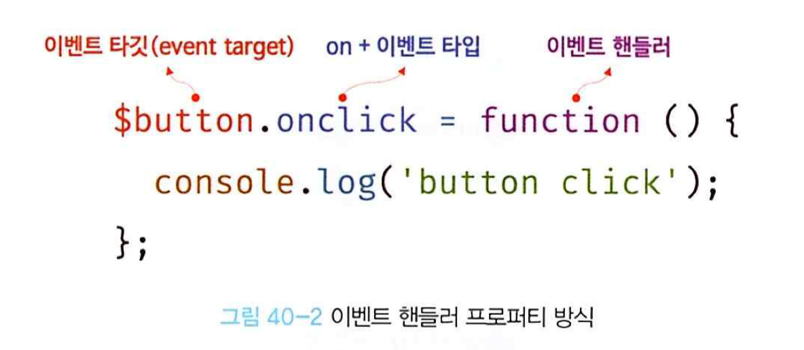
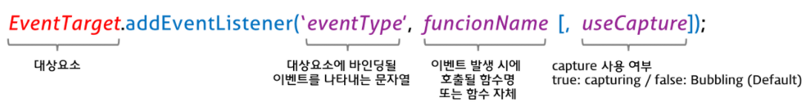
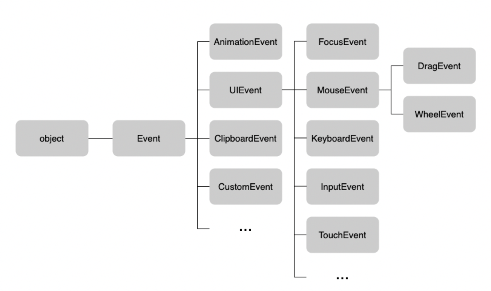
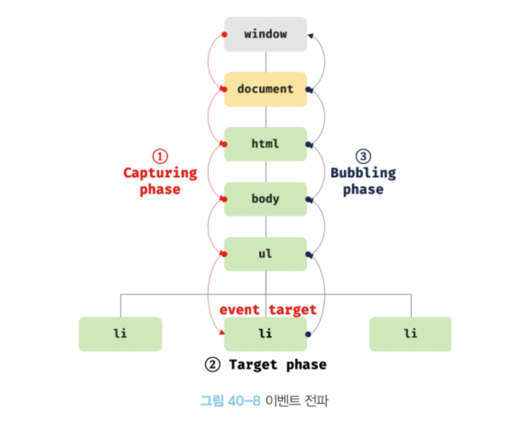

# [40장] 이벤트
### 40.1 이벤트 드리븐 프로그래밍
- 브라우저는 처리해야 할 특정 사건이 발생하면 이를 감지하여 이벤트를 발생시킴
- 이벤트 핸들러: 이벤트가 발생했을 때 호출될 함수
- 이벤트 핸들러 등록: 이벤트가 발생했을 때 브라우저에게 이벤트 핸들러의 호출을 위임하는 것
→ 함수를 언제 호출할지 알 수 없기 때문에 개발자가 명시적으로 함수를 호출하는 것이 아니라 브라우저에게 함수 호출 위임
- 이벤트 드리븐 프로그래밍: 프로그램의 흐름을 이벤트 중심으로 제어하는 프로그래밍 방식 → 이벤트와 이벤트 핸들러를 통해 사용자-애플리케이션 상호작용

### 40.2 이벤트 타입
이벤트 타입: 이벤트 종류를 나타내는 문자열

#### 마우스 이벤트
이벤트 타입 | 이벤트 발생 시점
--|--
click | 마우스 버튼을 클릭했을 때
dblclick | 마우스 버튼을 더블 클릭했을 때
mousedown | 마우스 버튼을 눌렀을 때
mouseup | 누르고 있던 마우스 버튼을 놓았을 때
mousemove | 마우스 커서를 움직였을 때
mouseenter | 마우스 커서를 HTML 요소 안으로 이동했을 때(버블링 X)
mouseover | 마우스 커서를 HTML 요소 안으로 이동했을 때(버블링 O)
mouseleave | 마우스 커서를 HTML 요소 밖으로 이동했을 때(버블링 X)
mouseout | 마우스 커서를 HTML 요소 밖으로 이동했을 때(버블링 O)

#### 키보드 이벤트
이벤트 타입 | 이벤트 발생 시점
--|--
keydown | 모든 키를 눌렀을 때 발생
keypress | 문자 키를 눌렀을 때 연속적으로 발생
keyup | 누르고 있던 키를 놓았을 때 한 번만 발생

#### 포커스 이벤트
이벤트 타입 | 이벤트 발생 시점
--|--
focus | HTML 요소가 포커스를 받았을 때(버블링 X)
blur | HTML 요소가 포커스를 잃었을 때(버블링 X)
focusin | HTML 요소가 포커스를 받았을 때(버블링 O)
focusout | HTML 요소가 포커스를 잃었을 때(버블링 O)

#### 폼 이벤트
이벤트 타입 | 이벤트 발생 시점
--|--
submit | form 요소 내의 submit 버튼을 클릭했을 때
reset | form 요소 내의 reset 버튼을 클릭했을 때

#### 값 변경 이벤트
이벤트 타입 | 이벤트 발생 시점
--|--
input | input 요소의 값이 입력되었을 때
change | input 요소의 값이 변경되었을 때 → HTML 요소가 포커스를 잃었을 때 사용자 입력이 종료되었다고 인식하여 발생
readystatechange | HTML 문서의 로드와 파싱 상태를 나타내는 readyState 프로퍼티 값(loading, interactive, complete)이 변경될 때

#### DOM 뮤테이션 이벤트
이벤트 타입 | 이벤트 발생 시점
--|--
DOMContentLoaded | HTML 문서의 로드와 파싱이 완료되어 DOM 생성이 완료되었을 때

#### 뷰 이벤트
이벤트 타입 | 이벤트 발생 시점
--|--
resize | 브라우저 window의 크기를 리사이즈할 때 연속적으로 발생 → window 객체에서만 발생
scroll | document 또는 HTML 요소를 스크롤할 때 연속적으로 발생

#### 리소스 이벤트
이벤트 타입 | 이벤트 발생 시점
--|--
load | DOMContentLoaded 이벤트가 발생한 이후, 모든 리소스의 코딩이 완료되었을 때
unload | 리소스가 언로드될 때 e.g. 새로운 웹페이지 요청
abort | 리소스 로딩이 중단되었을 때
error | 리소스 로딩이 실패했을 때

*cf)* [Event reference(이벤트 타입 상세 목록)](https://developer.mozilla.org/ko/docs/Web/API/Event)


### 40.3 이벤트 핸들러 등록
#### 이벤트 핸들러 어트리뷰트
- `on 접두사 + 이벤트 타입` e.g. onclick
- 이벤트 핸들러 어트리뷰트 값으로 함수 호출문 등의 문(statement)을 할당하면 이벤트 핸들러가 등록됨 → 함수 참조 X
  - 함수 호출문을 등록하면 함수 호출문의 평가 결과가 이벤트 핸들러로 등록
  - 이벤트 핸들러 어트리뷰트 값은 암묵적으로 생성될 이벤트 핸들러의 함수 몸체를 의미함
  - 이벤트 핸들러 어트리뷰트 값으로 함수 참조를 할당하면 이벤트 핸들러에 인수를 전달하기 어려움
```
<!DOCTYPE html>
<html>
<body>
  <button onclick="sayHi('Lee')">Click me!</button>
  <script>
    function sayHi(name) {
      console.log(`Hi! ${name}.`);
    }
  </script>
</body>
</html>
```

#### 이벤트 핸들러 프로퍼티
- `on 접두사 + 이벤트 타입`
- 이벤트 핸들러 프로퍼티에 함수를 바인딩하면 이벤트 핸들러가 등록됨
  - 이벤트 타깃(이벤트를 발생시킬 객체), 이벤트 타입(이벤트의 종류), 이벤트 핸들러 지정
  
- 이벤트 핸들러 프로퍼티에 하나의 이벤트 핸들러만 바인딩할 수 있음
```
<!DOCTYPE html>
<html>
<body>
  <button>Click me!</button>
  <script>
    const $button = document.querySelector('button');

    // 이벤트 핸들러 프로퍼티에 이벤트 핸들러를 바인딩
    $button.onclick = function () {
      console.log('button click');
    };
  </script>
</body>
</html>
```

#### `EventTarget.prototype.addEventListener`

- 이벤트 타입 → on 접두사를 붙이지 않음
- `useCapture` → 이벤트 전파 단계 지정
  - `false`: 버블링 단계에서 이벤트 캐치
  - `true`: 캡처링 단계에서 이벤트 캐치
```
<!DOCTYPE html>
<html>
<body>
  <button>Click me!</button>
  <script>
    const $button = document.querySelector('button');

    // 이벤트 핸들러 프로퍼티 방식은 하나의 이벤트에 하나의 이벤트 핸들러만을 바인딩할 수 있다.
    // 첫 번째로 바인딩된 이벤트 핸들러는 두 번째 바인딩된 이벤트 핸들러에 의해 재할당되어
    // 실행되지 않는다.
    $button.onclick = function () {
      console.log('Button clicked 1');
    };

    // 두 번째로 바인딩된 이벤트 핸들러
    $button.onclick = function () {
      console.log('Button clicked 2');
    };
  </script>
</body>
</html>
```
- 이벤트 핸들러 프로퍼티에 바인딩된 이벤트 핸들러의 아무런 영향을 주지 않음
- 하나 이상의 이벤트 핸들러 등록 가능 → 등록된 순서대로 호출

### 40.4 이벤트 핸들러 제거
`EventTarget.prototype.removeEventListener`: `addEventListener` 메서드로 등록한 이벤트 핸들러 제거
- addEventLister 메서드에 전달한 인수와 removeEventListener 메서드에 전달한 인수가 일치하지 않으면 이벤트 핸들러가 제거되지 않음
```
<!DOCTYPE html>
<html>
<body>
  <button>Click me!</button>
  <script>
    const $button = document.querySelector('button');

    const handleClick = () => console.log('button click');

    // 이벤트 핸들러 등록
    $button.addEventListener('click', handleClick);

    // 이벤트 핸들러 제거
    // addEventListener 메서드에 전달한 인수와 removeEventListener 메서드에
    // 전달한 인수가 일치하지 않으면 이벤트 핸들러가 제거되지 않는다.
    $button.removeEventListener('click', handleClick, true); // 실패
    $button.removeEventListener('click', handleClick); // 성공
  </script>
</body>
</html>
```
- 이벤트 핸들러를 제거하려면 이벤트 핸들러의 참조를 변수나 자료구조에 저장하고 있어야 함 → 무명 이벤트 핸들러는 제거 불가
  ```
  // 이벤트 핸들러 등록
  $button.addEventListener('click', () => console.log('button click'));
  // 등록한 이벤트 핸들러를 참조할 수 없으므로 제거할 수 없다.
  ```
- 기명 이벤트 핸들러 내부에서 removeEventListener 메서드를 호출하여 이벤트 제거 가능 → 이벤트 핸들러는 단 한 번만 호출
  ```
  // 기명 함수를 이벤트 핸들러로 등록
  $button.addEventListener('click', function foo() {
    console.log('button click');
    // 이벤트 핸들러를 제거한다. 따라서 이벤트 핸들러는 단 한 번만 호출된다.
    $button.removeEventListener('click', foo);
  });
  ```
- 무명함수 제거: `arguments.callee` → 코드 최적화 방해로 strict mode에서 사용이 금지됨
  ```
  // 무명 함수를 이벤트 핸들러로 등록
  $button.addEventListener('click', function () {
    console.log('button click');
    // 이벤트 핸들러를 제거한다. 따라서 이벤트 핸들러는 단 한 번만 호출된다.
    // arguments.callee는 호출된 함수, 즉 함수 자신을 가리킨다.
    $button.removeEventListener('click', arguments.callee);
  });
  ```
- 이벤트 핸들러 방식으로 등록한 이벤트 핸들러는 removeEventListener로 제거할 수 없음 → 이벤트 프로퍼티에 null 할당

### 40.5 이벤트 객체
이벤트가 발생하면 이벤트에 관련한 다양한 정보를 담고 있는 이벤트 객체가 동적으로 생성 → 이벤트 핸들러의 첫번째 인수로 전달
- 이벤트 핸들러 어트리뷰트 방식으로 이벤트 핸들러 등록 시 첫번째 매개변수 이름은 반드시 `event`여야 함

#### 이벤트 객체의 상속 구조

- 생성자 함수를 호출하여 이벤트 객체 생성 가능
- 이벤트 객체는 생성자 함수와 더불어 생성되는 프로토타입으로 구성된 프로토체인의 일원이 됨
- 이벤트 객체의 프로퍼티는 발생한 이벤트의 타입에 따라 달라짐

#### 이벤트 객체의 공통 프로퍼티
`Event.prototype`에 정의되어 있는 이벤트 관련 프로퍼티는 모든 파생 이벤트 객체에 상속
<table>
<tr><th>공통 프로퍼티</th><th>설명</th><th>타입</th></tr>
<tr><td>type</td><td>이벤트 타입</td><td>string</td></tr>
<tr><td>target</td><td>이벤트를 발생시킨 DOM 요소</td><td>DOM 요소 노드</td></tr>
<tr><td>currentTarget</td><td>이벤트 핸들러가 바인딩된 DOM 요소</td><td>DOM 요소 노드</td></tr>
<tr><td>eventPhase</td><td>이벤트 전파 단계<br/>0: 이벤트 없음, 1: 캡처링 단계, 2: 타깃 단계, 3: 버블링 단계</td><td>number</td></tr>

<tr><td>bubbles</td><td>이벤트를 버블링으로 전파하는지 여부<br/>cf) 버블링하지 않는 이벤트(bubbles: false)<br/>- 포커스 이벤트 focus/blur<br/>- 리소스 이벤트 load/unload/abort/error<br/>- 마우스 이벤트 mosueenter/mouseleave</td><td>boolean</td></tr>
<tr><td>cancelable</td><td>preventDefault 메서드를 호출하여 이벤트의 기본 동작을 취소할 수 있는지 여부<br/>cf) 취소할 수 없는 이벤트(cancelable: false)<br/>- 포커스 이벤트 focus/blur<br/>- 리소스 이벤트 load/unload/abort/error<br/>- 마우스 이벤트 dblclick/mosueenter/mouseleave</td><td>boolean</td></tr>
<tr><td>defaultPrevented</td><td>preventDefault 메서드를 호출하여 이벤트를 취소했는지 여부</td><td>boolean</td></tr>
<tr><td>isTrusted</td><td>사용자의 행위에 의해 발생한 이벤트인지 여부</td><td>boolean</td></tr>
<tr><td>timeStamp</td><td>이벤트가 발생한 시각</td><td>number</td></tr>
</table>

#### 마우스 정보 취득
- **마우스 포인터의 좌표 정보를 나타내는 프로퍼티**: screenX/screenY, clientX/clientY, pageX/pageY, offsetX/offsetY
  - clientX/clientY: 뷰포트를 기준으로 마우스 포인터 좌표
  *cf)* [각각의 좌표 차이](https://developer.mozilla.org/ko/docs/Web/API/MouseEvent/clientX)
- **버튼 정보를 나타내는 프로퍼티**: altKey, ctrlKey, shiftKey, button

#### 키보드 정보 취득
- altKey, ctrlKey, shiftKey, metaKey, key, keyCode
- [입력한 키와 key 프로퍼티 값의 대응 관계](https://www.toptal.com/developers/keycode)

### 40.6 이벤트 전파
- DOM 트리 상에 존재하는 DOM 요소 노드에서 발생한 이벤트는 DOM 트리를 통해 전파
- 이벤트 발생으로 생성된 이벤트 객체는 이벤트 타깃(이벤트를 발생시킨 DOM 요소)을 중심으로 DOM 트리를 통해 전파


#### 이벤트 전파 단계
→ 이벤트 객체가 전파되는 방향에 따라 구분
  - 캡처링 단계: 이벤트가 상위 요소에서 하위 요소 방향으로 전파
  - 타깃 단계: 이벤트가 이벤트 타깃에 도달
  - 버블링 단계: 이벤트가 하위 요소에서 상위 요소 방향으로 전파
- 이벤트 핸들러 어트리뷰트/프로퍼티 방식으로 등록한 이벤트 핸들러는 타깃 단계와 버블링 단계의 이벤트만 캐치 가능
- addEventListener 메서드 방식으로 등록한 이벤트 핸들러는 3번째 인수로 true를 전달하면 캡처링 단계의 이벤트도 캐치 가능
```
<!DOCTYPE html>
<html>
<body>
  <ul id="fruits">
    <li id="apple">Apple</li>
    <li id="banana">Banana</li>
    <li id="orange">Orange</li>
  </ul>
  <script>
    const $fruits = document.getElementById('fruits');
    const $banana = document.getElementById('banana');

    // #fruits 요소의 하위 요소인 li 요소를 클릭한 경우
    // 캡처링 단계의 이벤트를 캐치한다.
    $fruits.addEventListener('click', e => {
      console.log(`이벤트 단계: ${e.eventPhase}`); // 1: 캡처링 단계
      console.log(`이벤트 타깃: ${e.target}`); // [object HTMLLIElement]
      console.log(`커런트 타깃: ${e.currentTarget}`); // [object HTMLUListElement]
    }, true);

    // 타깃 단계의 이벤트를 캐치한다.
    $banana.addEventListener('click', e => {
      console.log(`이벤트 단계: ${e.eventPhase}`); // 2: 타깃 단계
      console.log(`이벤트 타깃: ${e.target}`); // [object HTMLLIElement]
      console.log(`커런트 타깃: ${e.currentTarget}`); // [object HTMLLIElement]
    });

    // 버블링 단계의 이벤트를 캐치한다.
    $fruits.addEventListener('click', e => {
      console.log(`이벤트 단계: ${e.eventPhase}`); // 3: 버블링 단계
      console.log(`이벤트 타깃: ${e.target}`); // [object HTMLLIElement]
      console.log(`커런트 타깃: ${e.currentTarget}`); // [object HTMLUListElement]
    });
  </script>
</body>
</html>
```
- DOM 트리를 통해 전파되는 이벤트는 이벤트 패스에 위치한 모든 DOM 요소에서 캐치 가능

#### 버블링을 통해 전파되지 않는 이벤트
→ 캡처링 단계의 이벤트를 캐치해야 함
분류 | 버블링을 통해 전파되지 않는 이벤트 | 대체 이벤트
--|--|--
포커스 이벤트|focus/blur|focusin/focusout
리소스 이벤트|load/unload/abort/error|
마우스 이벤트|mouseenter/mouseleave|mouseover/mouseout

### 40.7 이벤트 위임
- 여러 개의 하위 DOM 요소에 각각 이벤트 핸들러를 등록하는 대신 하나의 상위 DOM 요소에 이벤트 핸들러를 등록하는 방법
- 상위 요소에 이벤트 핸들러를 등록하기 때문에 이벤트 타깃이 개발자가 기대한 DOM 요소가 아닐 수 있음
- 이벤트 객체의 target 프로퍼티와 currentTarget 프로퍼티가 다른 DOM 요소를 가리킬 수 있음

### 40.8 DOM 요소의 기본 동작의 조작
#### `preventDefault`
DOM 요소의 기본 동작을 중단시키는 메서드
```
<!DOCTYPE html>
<html>
<body>
  <a href="https://www.google.com">go</a>
  <input type="checkbox">
  <script>
    document.querySelector('a').onclick = e => {
      // a 요소의 기본 동작을 중단한다.
      e.preventDefault();
    };

    document.querySelector('input[type=checkbox]').onclick = e => {
      // checkbox 요소의 기본 동작을 중단한다.
      e.preventDefault();
    };
  </script>
</body>
</html>
```

#### `stopPropagation`
이벤트 전파를 중지시키는 메서드 → 하위 DOM 요소의 이벤트를 개별적으로 처리하기 위해 사용
```
<!DOCTYPE html>
<html>
<body>
  <div class="container">
    <button class="btn1">Button 1</button>
    <button class="btn2">Button 2</button>
    <button class="btn3">Button 3</button>
  </div>
  <script>
    // 이벤트 위임. 클릭된 하위 버튼 요소의 color를 변경한다.
    document.querySelector('.container').onclick = ({ target }) => {
      if (!target.matches('.container > button')) return;
      target.style.color = 'red';
    };

    // .btn2 요소는 이벤트를 전파하지 않으므로 상위 요소에서 이벤트를 캐치할 수 없다.
    document.querySelector('.btn2').onclick = e => {
      e.stopPropagation(); // 이벤트 전파 중단
      e.target.style.color = 'blue';
    };
  </script>
</body>
</html>
```

### 40.9 이벤트 핸들러 내부의 this
#### 이벤트 핸들러 어트리뷰트 방식
- 이벤트 핸들러 어트리뷰트의 값으로 지정한 문 → 일반 함수로 호출
- 일반 함수로서 호출되는 함수 내부의 this는 전역 객체(window)를 가리킴
- 이벤트 핸들러를 호출할 때 인수로 전달한 this는 이벤트를 바인딩한 DOM 요소를 가리킴
```
<!DOCTYPE html>
<html>
<body>
  <button onclick="handleClick(this)">Click me</button>
  <script>
    function handleClick(button) {
      console.log(button); // 이벤트를 바인딩한 button 요소
      console.log(this);   // window
    }
  </script>
</body>
</html>
```

#### 이벤트 핸들러 프로퍼티 방식과 addEventListener 메서드 방식
- 이벤트 핸들러 프로퍼티 방식과 addEventListener 메서드 방식 모두 이벤트 핸들러 내부의 this는 이벤트를 바인딩한 DOM 요소를 가리킴 → `this === currentTarget`
- 화살표 함수로 정의한 이벤트 핸들러 내부의 this는 상위 스코프의 this를 가리킴 → `this !== currentTarget`
- 클래스에서 이벤트 핸들러를 바인딩하는 경우 → 메서드 내부의 this가 클래스가 생성할 인스턴스를 가리키도록 해야 함
  - bind 메서드를 사용해 this를 전달
    ```
    <!DOCTYPE html>
    <html>
    <body>
      <button class="btn">0</button>
      <script>
        class App {
          constructor() {
            this.$button = document.querySelector('.btn');
            this.count = 0;

            // increase 메서드를 이벤트 핸들러로 등록
            // this.$button.onclick = this.increase;

            // increase 메서드 내부의 this가 인스턴스를 가리키도록 한다.
            this.$button.onclick = this.increase.bind(this);
          }

          increase() {
            this.$button.textContent = ++this.count;
          }
        }

        new App();
      </script>
    </body>
    </html>
    ```
  - 클래스 필드에 할당한 화살표 함수를 이벤트 핸들러로 등록
    ```
    <!DOCTYPE html>
    <html>
    <body>
      <button class="btn">0</button>
      <script>
        class App {
          constructor() {
            this.$button = document.querySelector('.btn');
            this.count = 0;

            // 화살표 함수인 increase를 이벤트 핸들러로 등록
            this.$button.onclick = this.increase;
          }

          // 클래스 필드 정의
          // increase는 인스턴스 메서드이며 내부의 this는 인스턴스를 가리킨다.
          increase = () => this.$button.textContent = ++this.count;
        }
        new App();
      </script>
    </body>
    </html>
    ```

### 40.10 이벤트 핸들러에 인수 전달
- 이벤트 핸들러 어트리뷰트 방식은 함수 호출문을 사용할 수 있기 때문에 인수 전달 가능
- 이벤트 핸들러 프로퍼티 방식과 addEventListener 메서드 방식은 이벤트 핸들러를 브라우저가 호출 → 함수 자체를 등록해야 하기 때문에 인수를 전달할 수 없음
→ 이벤트 핸들러 내부 또는 이벤트 핸들러를 반환하는 함수를 호출하면서 인수 전달
```
<!DOCTYPE html>
<html>
<body>
  <label>User name <input type='text'></label>
  <em class="message"></em>
  <script>
    const MIN_USER_NAME_LENGTH = 5; // 이름 최소 길이
    const $input = document.querySelector('input[type=text]');
    const $msg = document.querySelector('.message');

    // 이벤트 핸들러를 반환하는 함수
    const checkUserNameLength = min => e => {
      $msg.textContent
        = $input.value.length < min ? `이름은 ${min}자 이상 입력해 주세요` : '';
    };

    // 이벤트 핸들러를 반환하는 함수를 호출하면서 인수를 전달한다.
    $input.onblur = checkUserNameLength(MIN_USER_NAME_LENGTH);
  </script>
</body>
</html>
```

### 40.11 커스텀 이벤트
#### 커스텀 이벤트 생성
- 이벤트 생성자 함수를 호출하여 임의의 이벤트 타입 지정
- 첫번째 인수로 이벤트 타입을 나타내는 문자열 전달 → 기존 이벤트 타입 또는 임의의 문자열
  ```
  // KeyboardEvent 생성자 함수로 keyup 이벤트 타입의 커스텀 이벤트 객체를 생성
  const keyboardEvent = new KeyboardEvent('keyup');
  console.log(keyboardEvent.type); // keyup

  // CustomEvent 생성자 함수로 foo 이벤트 타입의 커스텀 이벤트 객체를 생성
  const customEvent = new CustomEvent('foo');
  console.log(customEvent.type); // foo
  ```
- 커스텀 이벤트 객체는 버블링되지 않으며 preventDefault 메서드로 취소할 수 없음
  → 두번째 인수로 bubbles 또는 cancelable 프로퍼티를 갖는 객체 전달
  ```
  // MouseEvent 생성자 함수로 click 이벤트 타입의 커스텀 이벤트 객체를 생성
  const customEvent = new MouseEvent('click', {
    bubbles: true,
    cancelable: true
  });

  console.log(customEvent.bubbles); // true
  console.log(customEvent.cancelable); // true
  ```
- 이벤트 객체 고유의 프로퍼티 값을 지정하려면 두번째 인수로 프로퍼티 전달
  ```
  // MouseEvent 생성자 함수로 click 이벤트 타입의 커스텀 이벤트 객체를 생성
  const mouseEvent = new MouseEvent('click', {
    bubbles: true,
    cancelable: true,
    clientX: 50,
    clientY: 100
  });

  console.log(mouseEvent.clientX); // 50
  console.log(mouseEvent.clientY); // 100

  // KeyboardEvent 생성자 함수로 keyup 이벤트 타입의 커스텀 이벤트 객체를 생성
  const keyboardEvent = new KeyboardEvent('keyup', { key: 'Enter' });

  console.log(keyboardEvent.key); // Enter
  ```
- 이벤트 생성자 함수로 생성한 커스텀 이벤트는 isTrusted 프로퍼티 값이 항상 false

#### `dispatchEvent` 메서드
- 디스패치(이벤트를 발생시키는 행위) 가능
- 이벤트 객체를 인수로 전달하면서 호출하면 인수로 전달한 이벤트 타입의 이벤트가 발생
- 일반적인 이벤트 핸들러는 비동기로 동작하지만 dispatchEvent 메서드는 동기 처리 방식으로 호출
```
<!DOCTYPE html>
<html>
<body>
  <button class="btn">Click me</button>
  <script>
    const $button = document.querySelector('.btn');

    // 버튼 요소에 foo 커스텀 이벤트 핸들러를 등록
    // 커스텀 이벤트를 디스패치하기 이전에 이벤트 핸들러를 등록해야 한다.
    $button.addEventListener('foo', e => {
      // e.detail에는 CustomEvent 함수의 두 번째 인수로 전달한 정보가 담겨 있다.
      alert(e.detail.message);
    });

    // CustomEvent 생성자 함수로 foo 이벤트 타입의 커스텀 이벤트 객체를 생성
    const customEvent = new CustomEvent('foo', {
      detail: { message: 'Hello' } // 이벤트와 함께 전달하고 싶은 정보
    });

    // 커스텀 이벤트 디스패치
    $button.dispatchEvent(customEvent);
  </script>
</body>
</html>
```

커스텀 이벤트 객체를 생성한 경우 반드시 addEventListener 메서드 방식으로 이벤트를 등록해야 함